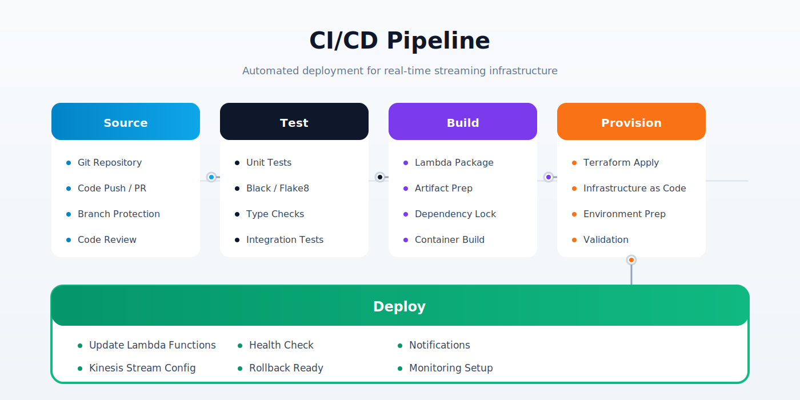

<div align="center">
  <h1>Real-Time Data Streaming Pipeline</h1>
  <p>High-throughput, fault-tolerant real-time data streaming pipeline built on AWS</p>
</div>

<div align="center">
  <a href="https://github.com/vinitsoni03/realtime-streaming-pipeline/actions">
    
  </a>
  <a href="https://www.python.org/">
    
  </a>
  <a href="https://aws.amazon.com/kinesis/">
    
  </a>
  <a href="https://github.com/vinitsoni03/realtime-streaming-pipeline/blob/main/LICENSE">
    
  </a>
</div>

<br>

<div align="center">
  <strong>Sub-second latency with near real-time analytics</strong>
</div>

---

## Architecture


---

## CI/CD Pipeline



---

## Technology Stack

| Layer | Technology |
|---|---|
| Stream Ingestion | AWS Kinesis Data Streams |
| Event Processing | AWS Lambda (Python 3.11) |
| Transformation | Lambda event-driven transformations |
| Monitoring | AWS CloudWatch (alarms, dashboards, metrics) |
| CI/CD | GitHub Actions |
| Scripting | Bash, Linux |
| Infrastructure as Code | Terraform (basics) |
| Language | Python, Bash |

---

## Key Features

- **Sub-second latency**: End-to-end from producer to processed output in < 1 second at p95
- **Fault-tolerant architecture**: Producer-consumer pattern with dead-letter queues and automatic retry
- **Horizontal scalability**: Kinesis shard scaling handles variable load; Lambda concurrency scales to demand
- **Minimized MTTD**: CloudWatch alarms fire on iterator age, throttle counts, and error rates
- **GitHub Actions CI/CD**: Fully automated test → build → deploy on every push to main
- **Bash-driven ops**: Shell scripts for alarm provisioning, pipeline monitoring, and incident response

---

## Project Structure

```
realtime-streaming-pipeline/
├── producer/
│   ├── producer.py            # Data producer — pushes records to Kinesis stream
│   ├── data_generator.py      # Synthetic / real data source simulator
│   └── config.py              # Stream name, region, batch size
│
├── consumer/
│   ├── lambda_function.py     # Kinesis trigger Lambda — consumes + transforms
│   ├── transformer.py         # Business logic: parse, enrich, validate records
│   └── dlq_handler.py         # Dead-letter queue handling for failed records
│
├── analytics/
│   ├── aggregator.py          # Windowed aggregations (tumbling, sliding)
│   └── output_sink.py         # Write results to S3 / downstream systems
│
├── monitoring/
│   ├── setup_alarms.sh        # Bash: create CloudWatch alarms via AWS CLI
│   ├── dashboard.json         # CloudWatch dashboard definition (JSON)
│   └── healthcheck.sh         # Bash: stream health verification script
│
├── infrastructure/
│   ├── kinesis.tf             # Kinesis stream (shards, retention)
│   ├── lambda.tf              # Lambda function + Kinesis event source mapping
│   ├── iam.tf                 # IAM roles for Lambda and producer
│   └── cloudwatch.tf          # Alarms, log groups, dashboards
│
├── .github/
│   └── workflows/
│       └── deploy.yml         # GitHub Actions CI/CD workflow
│
├── scripts/
│   ├── deploy.sh              # Bash: package and deploy Lambda to AWS
│   ├── scale_shards.sh        # Bash: adjust Kinesis shard count
│   └── tail_logs.sh           # Bash: live CloudWatch log tailing
│
├── tests/
│   ├── test_producer.py
│   ├── test_transformer.py
│   └── test_aggregator.py
│
├── architecture.svg
├── pipeline.svg
└── README.md
```

---

## CI/CD Pipeline Details (GitHub Actions + Bash)

```yaml
# .github/workflows/deploy.yml (summary)
on:
  push:
    branches: [main]
  pull_request:
    branches: [main]

jobs:
  test-and-deploy:
    steps:
      - Checkout code
      - Set up Python 3.11
      - pip install dependencies
      - pytest (unit + integration tests)
      - Package Lambda ZIPs (Bash)
      - aws lambda update-function-code
      - bash monitoring/setup_alarms.sh   # Ensure alarms current
      - bash monitoring/healthcheck.sh    # Verify stream healthy
      - Notify on success / failure
```

---

## CloudWatch Monitoring

| Alarm | Threshold | Action |
|---|---|---|
| GetRecords.IteratorAgeMilliseconds | > 60,000 ms | SNS alert — consumer falling behind |
| Lambda.Errors | > 1% error rate | SNS alert + auto-scale trigger |
| Lambda.Throttles | > 5 throttles/min | Scale Lambda concurrency |
| Kinesis.WriteProvisionedThroughputExceeded | > 0 | Add shards via scale_shards.sh |
| Kinesis.ReadProvisionedThroughputExceeded | > 0 | Add consumer Lambda instances |

---

## Security

- Lambda execution role: kinesis:GetRecords, kinesis:GetShardIterator — no broader access
- Producer IAM user: kinesis:PutRecord, kinesis:PutRecords only
- Stream encrypted at rest with AWS KMS
- CloudWatch Logs encrypted; log retention set to 30 days

---

## Performance Metrics

| Metric | Result |
|---|---|
| End-to-end latency (p95) | < 1 second |
| Throughput per shard | 1 MB/s ingestion, 2 MB/s read |
| Lambda processing (p50) | ~120ms |
| Iterator age at steady state | < 5 seconds |
| Fault recovery (DLQ + retry) | < 30 seconds |

---

## Quick Start

### Prerequisites
- Python 3.11+
- [Poetry](https://python-poetry.org/docs/#installation)
- AWS CLI configured

### Local Development

```bash
# Clone
git clone https://github.com/vinitsoni03/realtime-streaming-pipeline.git
cd realtime-streaming-pipeline

# Install dependencies
poetry install
poetry shell

# Run tests
pytest tests/

# Run producer locally
python producer/producer.py
```

### Deployment

```bash
# Deploy infrastructure
cd infrastructure
terraform init
terraform apply

# Set up CloudWatch alarms
bash ../monitoring/setup_alarms.sh

# Deploy Lambda consumer
bash ../scripts/deploy.sh

# Tail live logs
bash ../scripts/tail_logs.sh
```

---

## Environment Variables

```env
AWS_REGION=ap-south-1
KINESIS_STREAM_NAME=vinit-data-stream-prod
KINESIS_SHARD_COUNT=2
LAMBDA_CONSUMER_NAME=stream-consumer
DLQ_URL=https://sqs.ap-south-1.amazonaws.com/.../dlq
OUTPUT_S3_BUCKET=vinit-stream-output
```

---

## License

MIT © Vinit Soni — [LinkedIn](https://linkedin.com/in/vinitsoni-060306m) · [GitHub](https://github.com/vinitsoni03)
